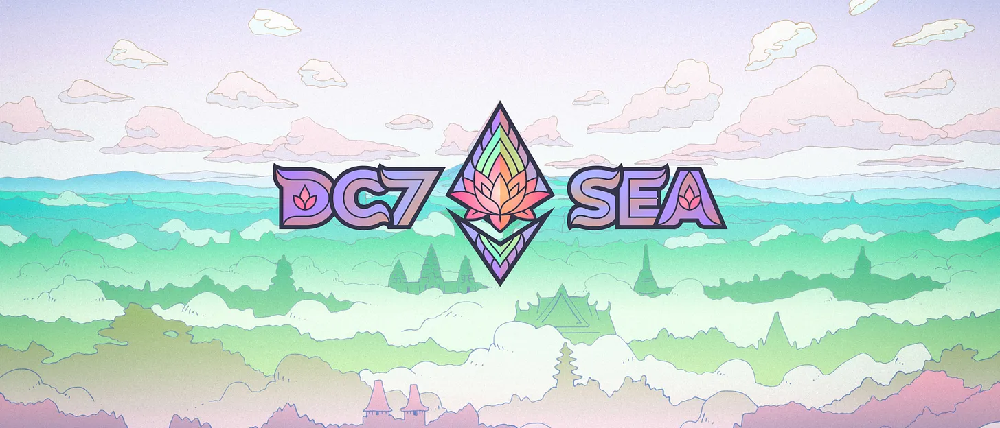

# My Devcon7 Experience: Exploring Bangkok, Web3 Innovation, and SEA Culture 🐘🛺🛕

<figure><figcaption>
#DC7SEA
</figcaption></figure>

### The Devcon experience

The conference took place at the📍[Queen Sirikit National Convention Center](https://en.wikipedia.org/wiki/Queen_Sirikit_National_Convention_Center), an impressive venue that hosted diverse activities, discussions and cultural exhibits. I immersed myself in workshops, hackathons and booths showcasing the latest web3 innovations. From though-provoking talks to hands-on activities, every moment felt purposeful.

One highlight was attending the [Capture The Flag](https://ctf.buidlguidl.com/) hackathon by the [**BuidlGuidl**](https://buidlguidl.com/) team, where I saw [**Austin Griffith**](https://x.com/austingriffith) and his team in action. Their passion in onboarding developers to web3 were amazing.

<figure><figcaption>
We participated in the Capture The Flag hackthon
</figcaption></figure>

The AVS day sessions were equally memorable where I finally met my long time web3 hero and Kinf of Restaking, [**Nader Dabit**](https://x.com/dabit3). Seeing him live during the event and snapping a selfie was a surreal moment for me.

<figure><figcaption>
Meeting the King of Restaking
</figcaption></figure>

### Connecting with the web3 community

Devcon wasn’t just about the talks, it was about the people. I had the chance to meet developers, founders and builders from all over the world. From solo developers working on open-source projects to DeFi exchange innovators, web3 accelerators, the conversations were eye-opening.

<figure><figcaption>
AVS Day presentation
</figcaption></figure>

<figure><figcaption>
DeSci Hub in Devcon
</figcaption></figure>

A significant part of my discussions revolved around web3 markets in the Southeast Asia region, particularly in the growing trends in The Philippines. Sharing insights and hearing different perspectives was a reminder of how connected, yet diverse this community is.

### Exploring Bangkok

Bangkok’s energy is contagious and I made the most of it. From attending side events hosted by well known to emerging projects to hopping on motorcycles to make it to networking events on time and the adventure never stopped.

<figure><figcaption>
Very powerful talk from Concensys - Metamask team
</figcaption></figure>

The food scene on each events are absolutely unmatched! Pad Thai runs are FTW and explored some iconic food hubs and markets. Trying out the SEA food exhibits at the convention was culinary satisfying, blending diverse flavors and traditions.

Even beyond the conference, Bangkok’s culture shone through. The exhibits at Queen Sirikit NCC were a testament to Thailand’s rich heritage. And I got to see a real-life Capybara! :)

<figure><figcaption>
Capybara! Hello Magnus!
</figcaption></figure>

### Late nights, long walks and meaningful moments

\
The days were long but rewarding, roaming from one side event to another, engaging in tech talks and attending after hours events that transitioned from professional to party mode. Late night networking with web3 founders and players can really lead to and be extended into a vibrant and crazy Bangkok party scene ;)

\
The trip ended on a very reflective meeting with my friend and web3 mentor, where we discussed lessons learned and the path ahead and how we can prepare the next generation and Filipino developers to fully embrace web3 and build awesome opportunities and experiences around it.

<figure><figcaption>
With the Bitskwela Team!
</figcaption></figure>

### Takeaways

Devcon 7 was really more than conferences — it was a celebration of innovation, culture, human connection and celebrating the efforts of people before us who furnished the web3 and blockchain path. Listening to stories of developers who shared their web3 journeys was both humbling and inspiring.

To everyone I met: thank you for the conversation, ideas and energy. Hoping to drop you all a message in Telegram, very very soon! Let’s continue building and shaping the future together.

If you’re in web3 and haven’t attended devcon yet, make it a priority — you’ll come away inspired, motivated and with renewed sense of purpose.

Until next time, Bangkok

Hit me up in X (Twitter): [**@kbpsystem**](https://x.com/kbpsystem)

Link Tree: [**https://linktr.ee/koleenbp**](https://linktr.ee/koleenbp)
